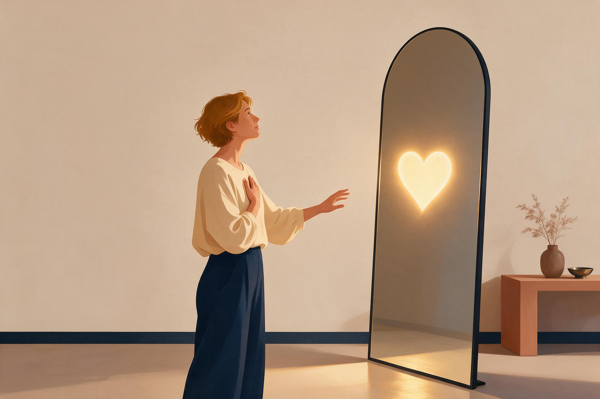

::: {.text-center}
{fig-align="center" width="50%"}
:::

Could it be that part of your desire to finally be in a romantic relationship comes from the hope of being rescued from your own life?

Like in all those Disney movies, where the long-awaited happy ending suddenly arrives. You meet someone, life becomes beautiful, you get a house together, and somehow the problems of life no longer have to be carried alone.

It sounds tempting. And the wish for this is completely understandable.

## Why We Long for Someone

The world around us is becoming increasingly complex. Everything seems to move faster, while people have perhaps never felt more disconnected from one another. Loneliness is increasing. Expectations are increasing, too.

So it can feel natural to wish for someone who will finally make life a little easier. Someone to share the weight with. Someone who makes us feel that we have finally arrived. But there is something we tend to forget:

**No romantic relationship can take responsibility for your life away from you.**

Your partner has a life, too. They bring their own wounds, insecurities, experiences, and struggles with them. The loss of someone close. Grief. Problems at work. Physical difficulties. Uncertainty about the future. …

So suddenly, it is not only about finding your own balance and taking care of yourself. You also have a relationship to take care of. Sometimes, being in a relationship does not make life simpler. It simply means that you are no longer carrying only your own life.

::: {.text-center}
{fig-align="center" width="50%"}
:::

## An Example of a Client 

The rescuer does not come. Not even the happy ending.

I came to understand this while accompanying a client through her process:

I remember her sitting in front of me, crying, longing deeply for a romantic relationship but having no success finding one. Then, after a few rather disappointing dates, she finally met someone. There was excitement.

Falling in love.

But there were other things, too: his divorce from his ex-wife, him building a house, his daughter from his first marriage. For a long time, my client waited and hoped that eventually she would have a bigger place in his life and that she would be able to move into the house with him. Things kept getting postponed. And then, finally, it happened. She moved in.

Happy ending?

No.

The ex-wife caused problems. They tried to have a child. A year went by without success. Then came the fertility clinic. And other issues appeared along the way.

The happy ending, it turns out, does not really arrive. Instead, there are new challenges.

## Maybe That's Just Life

We often imagine happiness as a destination.

Once I meet the right person.
Once we move in together.
Once we get married.
Once we have children.
Once everything falls into place.

And then, finally, we will be happy. But what if there is no final "once everything falls into place"? What if life simply keeps changing? And with change come new challenges.

Maybe the problem is not that we haven't found the right person yet. Maybe the problem is that we are asking another person to become the answer to a question that belongs to our own lives.

## What If There Is No Happy Ending?

What if a romantic relationship is not the happy ending?

What if it does not rescue you from your struggles, but instead solves some of them while bringing entirely new ones into your life?

Perhaps the answer is closer than we think.

Maybe we can let go of the idea that our life is supposed to end in a happy ending. And instead, we can start looking for the moments in which life feels meaningful, light, or simply good.

## A Life That Is Yours

Then it is no longer only about the house and the wedding rings.

Maybe it is about a passion. A hobby. Beautiful moments with people we care about. The journey we have been dreaming about.

The things that make us feel alive.

**It is about giving our own life the meaning that feels meaningful to us.**

And somewhere along the way, another person may choose to become part of that life. Just as we choose to become part of theirs. Together, you may discover new goals. You may experience new adventures. You may build something that neither of you could have imagined alone. 

That can be beautiful. But it is something very different from being rescued. There will not be a person who suddenly transforms your life and saves you from it. That part is yours.

---

::: {.text-center}
**A few questions to leave you with:**

**- What would you free yourself from if you stopped waiting for someone to "rescue" you?**

**- What gives your life meaning, independent of being in a romantic relationship?**

{fig-align="center" width="50%"}
:::